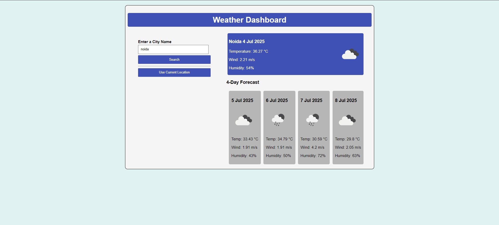
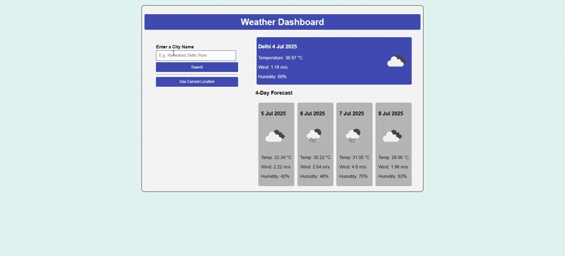

# 🌦️ Advanced Weather Dashboard with Geolocation

## 📸 Screenshot

## 🎞️ Demo

---

## 📖 Overview

The **Advanced Weather Dashboard** is a powerful web app that fetches and displays real-time weather conditions for any city, along with a 4-day forecast. What makes this app smarter is its **"Use Current Location"** feature that automatically detects your location and fetches data accordingly, making it ideal for both local and travel weather needs.

This project uses the OpenWeatherMap API and includes intuitive layout, error handling, and dynamic rendering.

---

## ✨ Features

- 🔍 Search weather by city name
- 🌐 Fetch weather for current location using Geolocation API
- 📅 Displays 4-day weather forecast with dynamic icons
- 🌡️ Real-time temperature, humidity, and wind speed
- 🎯 Error alerts for invalid cities or location denial
- 📱 Fully responsive design

---

## 🛠️ Tech Stack

- **Frontend:** HTML5, CSS3, JavaScript (ES6)
- **API Integration:** OpenWeatherMap
- **Browser API:** Geolocation API
- **Design:** Flexbox, responsive layout
- **Deployment:** GitHub Pages (optional)

---

## 🌱 Future Scope

- 🌓 Dark mode toggle  
- 🏙️ Add recent search history  
- 📍 Map integration with weather overlay  
- 🌍 Multilingual support  
- 🧭 Air quality and pressure data  
- 📲 Convert to React-based PWA with offline support  

---

## 🚀 How It Works

1. **Search by city**: Enter a city name and click search to fetch current weather and forecast.
2. **Use current location**: Click the location button to automatically fetch your location-based weather.
3. **View forecast**: See the forecast for the next 4 days with icons and temperature details.

---

## 🔗 Live Demo

Coming soon...

---

## 📁 Project Structure

